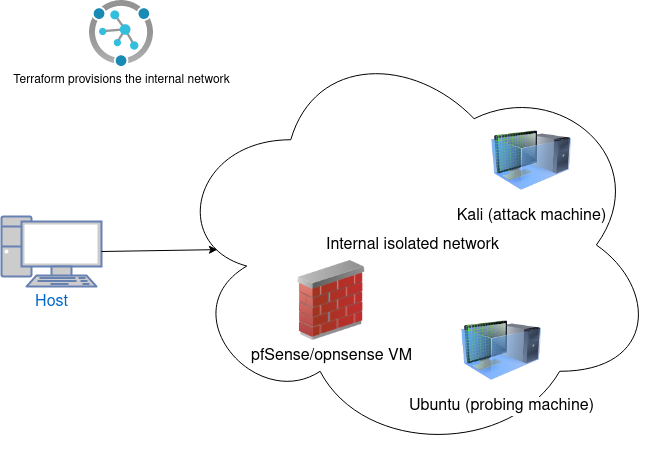
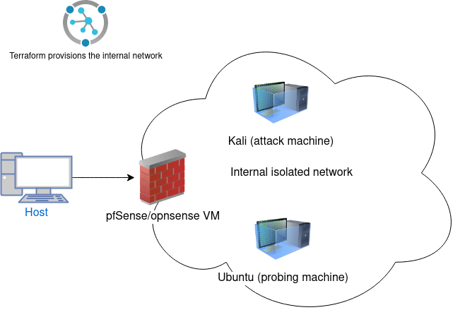
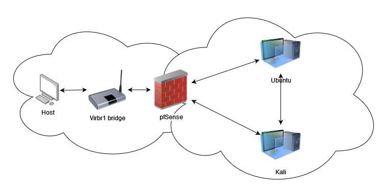

# 08/01/2024
Started researching Terraform and learning its basics.

# 09/01/2024
General first implementatio workflow for students:

1. Student creates a VM, installs and configures it to work as a firewall
2. Student uses Terraform/alternative to create the internal network
3. Student tests different options in firewall to allow/block access to said network
4. Student uses wireshark to play around with the network

After discussing with Niklas the firewall solution should be easily deployed as well along with the internal network so students have to do as little as possible to get the platform up and running.


# 10/01/2024
Figuring out a firewall solution that can be containerized, Niklas suggested QEMU/KMV solutions, dont worry about Terraforming it yet, first work it out with simple Dockerization. Problem with pfSense that Asad suggests is that it isn't really a good solution for containerization. Tried out simple-firewall, but it is deprecated and updated 7 years ago.

Network driver seems to be connected to the solution somehow:
https://docs.docker.com/network/drivers/

Perhaps creating a container with default alpine linux and changing it's iptables configuration could be a solution, but would it be real-life scenario like? This would be handled similarly to the docker-simple-firewall solution: https://github.com/0xcaff/docker-simple-firewall/tree/master

Whalewall seems like a good solution aswell :thinking_face: but the problem with this kind of solution as well as the iptables solution above is that there is no GUI, which would be great for teaching firewall usage.

Maybe easier tasks involve using iptables to configure firewall and then the harder tasks could involve setting up pfSense in a VM to handle this.

Relevant information:
1. https://medium.com/@qwerty1q2w/docker-compose-with-public-ip-address-firewall-configuring-a0a26aa78854
2. https://blog.jarrousse.org/2023/03/18/how-to-use-ufw-firewall-with-docker-containers/
3. https://github.com/capnspacehook/whalewall
4. https://github.com/BBVA/kvm

### Meeting discussion
Teemu: every related course is built on top of:
1. how networking works
2. sysadmin skills
- do we have any courses where we can expect students to have learnt these skills
3. the sysadmin content might have to be taught first -> if these skills take up too much time we need to push someone to offer a course that teaches these skills so this course can focus on cloud security
4. Configuration exercises could be good starting exercises, looking for bad configurations and fixing them

Problems with self-created VM that will be provided to students:
- Could not start the machine pfSense because the following physical network interfaces were not found:
vboxnet0 (adapter 1), wlan0 (adapter 2),
You can either change the machine's network settings or stop the machine.
- Need to create the host only adapter yourself and use that in the network settings of the VM that contains pfSense

# 11/1/2024
Started the day by testing out Asad's pre-made VM with pfsense installed, needed to Assign Interfaces in the CLI, but afterwise the connection was smooth.
It was pretty straight forward, just create a host-only network, then create local debug.rules file in ~ , configure it to allow access from the client machine and
outward access to the virtualbox VMs IP that has the pfsense. Was feeling under the weather so did a half-day.

# 12/1 - 15/1/2024
Working on debugging why the VM doesn't have an IP / DHCP lease.

When starting the terraform apply on a new session:
    Error defining libvirt domain: virError(Code=8, Domain=10, Message='invalid argument: could not get preferred machine for /usr/bin/qemu-system-x86_64 type=kvm').

Solution: export TERRAFORM_LIBVIRT_TEST_DOMAIN_TYPE="qemu"

Network exists/Vm/pool storage exists:
________________________________________________________
virsh net-destroy vm_network1
virsh pool-destroy vm_pool1
virsh net-undefine vm_network1
virsh pool-undefine vm_pool1
virsh vol-delete --pool vm_pool1 /tmp/terraform-provider-libvirt-pool/vm-0_volume.qcow2
virsh vol-delete --pool vm_pool1 /tmp/terraform-provider-libvirt-pool/vm_cloudinit.iso

created a cleanup script from these

Error: Error: couldn't retrieve IP address of domain.Please check following:
1) is the domain running proplerly?
2) has the network interface an IP address?
3) Networking issues on your libvirt setup?
 4) is DHCP enabled on this Domain's network?
5) if you use bridge network, the domain should have the pkg qemu-agent installed
IMPORTANT: This error is not a terraform libvirt-provider error, but an error caused by your KVM/libvirt infrastructure configuration/setup
 timeout while waiting for state to become 'all-addresses-obtained' (last state: 'waiting-addresses', timeout: 5m0s)

Same configurations with Ubuntu image works, but with pfSense image the IP address cant be retrieved.

# 16/1/2024
Working on previous issue, perhaps changing /confic/network_config to give a static IP address could work, going to test at home environment with dhcp = false. Test first with dhcp = true and figure out if it is something to do with dnsmasq? If not also check the /etc/rc.conf/ on the pfSense VM manually through the shell. Otherwise no clue what else to do.

Testing with https://stackoverflow.com/questions/71208688/terraform-libvirt-trouble-with-bridged-network now.

Things for 17/1/2024 meeting:
- issues with DHCP giving IP address to the freebsd pfSense VM --> timeouts when wait_for_lease is true
- the default libvirt NAT based network should configure it automatically
    - works if the image is the default ubuntu (pre-installed image...
        - Maybe the VM doesnt get into a state where it could ask for an IP address, I thought the IP address would be natively assigned automatically in libvirt (it doesn't)
- pfSense installer doesn't recognize the storage disk terraform creates for it
- still would need a lot of time to implement the correct network configurations Asad has configured and connection to docker containers (which would propably be handled by terraform/libvirt automatically)

check this blog:
https://blog.nihilism.network/servers/pf_virt/index.html


# 17/01/2024 - 19/01/2024
Try to use opnsense as an alternative for the terraform deployment.
Niklas posted some VM images in the cybsec slack channel that could prove useful.
Remember that Freebsd OS images differ a bit from Ubuntu images, take this into consideration.

Having students understand how UDP/TCP is handled through firewall would be good for students.

Niklas:
    - We should still continue looking at easy deployment
    - Create tasks at Asad's system, then port them over to the deployed vm after.

Got opnsense (amd64) to deploy with terraform and libvirt, it doesn't get allocated an IP address however, but installation is smooth!

Followed this:
https://github.com/Mosibi/centos8-terraform/


Tips:
__________________________________________________________________________________________
Make sure to have all the required installations: libvirtd, terraform, qemu etc.
Set interface IP address to match the network to get an IP address for the VM


Problem solutions in kvm creation:
__________________________________________________________________________________________
Error: Error while uploading source opensense.qcow2: Error while copying source to volume virError(Code=38, Domain=38, Message='cannot write to stream: No space left on device'
    - Make sure the file has completed copying to the system
Error: Error defining libvirt domain: virError(Code=67, Domain=10, Message='unsupported configuration: Emulator '/usr/bin/qemu-system-x86_64' does not support virt type 'kvm'')
    1. export TERRAFORM_LIBVIRT_TEST_DOMAIN_TYPE="qemu"
    2. use "qemu-system-x86_64 -machine help" to list all available machines, select one of the pc-q35 machines and change main.tf machine = "q35" to match this.
Error: VM doesnt start default installation
    - Make sure all terraform resources got successfully created at once, run "terraform destroy" and "terraform apply" to create them again.

do we want ssh connection? 

# 22/1/2024
Still issues in accessing the opnsense from host machine have tried setting rules like:
    - pass in quick on <wan_interface> from <host_wan_ipaddress> keep state
    - pass in quick on <wan_interface> from <opnsense_lan_address> keep state
    - pass in quick on <wan_interface> from <host_wan_ipaddr> to <opnsense_lan_address> keep state
    - pass in quick on <wan_interface> from <host_wan_ipaddr> to <opnsense_wan_address> keep state
    - disabling all rules
So far only managed to ping the WAN address of the KVM running opnsense... only idea is to keep
modifying the rules.debug file and testing out different rules. Pinging from opnsense to host works fine, so it is
firewall/networking related. Disabled pf rules completely, now the other Ubuntu in the WAN network can ping the opnsense vm.

Testing with the Ubuntu/Lubuntu desktop edition if that VM can reach the web GUI
 --> Too slow and wonky problems with mouse etc, not a viable solution for students to use.

lan vtnet0 192.168.1.1./24
wan vtnet1 192.168.0.59/24

the host PC is now able to reach the VM WAN, still need to figure out how to access the VM LAN address for the web GUI

Got access to VM LAN from host had to configure it to point out to 192.168.122.xxx, now needs to get the web gui up and running as well.

lan vtnet0 192.168.1.100
wan vtnet1 10.10.10.131

# 26/1/2024
Finally got access to the Web GUI by creating an isolated network interface that connects the opnsense kvm and the probing machine, this will work as the "internal network". Next step is to configure access through the default-interface so that we can access the opnsense machine with the host system. (for nmap stuff etc.)

Configuring the system requires you to run terraform apply, choose option 1 in opnsense and the following: n n vtnet0 vtnet1 vtnet2 y




# 29-30/1/2024
Added a Kali KVM that acts as the attacker, lets obfuscate the user logon credentials to the ubuntu KVM so that students cant access it, perhaps make it boot with some kind of web server that is sending traffic that we can analyze.

implementing icmpsh in this scenario would be pretty simple.
https://www.cynet.com/attack-techniques-hands-on/how-hackers-use-icmp-tunneling-to-own-your-network/

I think the first idea would be that students would nmap scan the internal network to find the IP address of the ubuntu machine, then move on to do what the icmpsh tutorial above describes.

Now there are 3 machines in the internal network, opnsense firewall, kali attacking machine and ubuntu target machine (currently desktop image, we can make it be GUI:less since students arent supposd to directly access it)

# 31/1/2024
Created a VM image running pfSense via virt-manager (router_pfsense.qcow2) and deployed it with minimal required configurations, shared the file with Asad. Waiting for his input.


# 01/2/2024
We are now at the stage where we just need to configure the network settings so that we can start implementing the tasks, Asad has been researching this, I will also take a look and start ideaing how the pfSense/opnsense firewall could work as the router that assigns the IP addresses in the internal network.




# 06/02/2024
New bridged network setup for lab 2, we create a custom virbr1 bridge that is used to connect the two networks together, both of these networks are attached to pfSense and only the internal network is attached to the VMs with this after configuration the pfSense VM should start serving DHCP leases to the other VMs in the network.



# 08/02/2024
We have settled on using the current version on master branch for the lab2, there are still some issues but it should get the job done. New focus is on creating a web server on to the internal network that the students could then attack. Currently 2 ideas of how this could be achieved:
1. Docker containers will be binded to the virbr0 bridge like this: https://serverfault.com/questions/948339/networking-between-kvm-vm-and-docker-container-on-same-host (haven't got the container to bind to 192.168.122.xxx or 10.0.0.xxx though it still gets 172.19.0.xxx)
2. By manually setting up docker containers to bind to an IP address in the internal network range, guide on docs
3. Creating an ubuntu image that contains all the tools required to set up the web server
4. Doing the 2. but from terraform

# 20/02/2024
Back from the sick leave. Lab 1 has been completed current implementation is with 3 different KVMs. Lets leave dockerizing the web server for future work for now.


# 21/02/2024
## Wireguard installation to pfSense
1. access WebGUI
2. System -> Package Manager
3. Search WireGuard -> Confirm install

## Wireguard configuration in pfSense
### Ideally we wouldnt want to use the CLI after we have gained access to the WebGUI anymore, so that is why we are using the WebGUI shell for configuration instead of using the pfSense VM CLI shell.
1. Diagnostics -> Command Prompt
2. wg genkey | tee privatekey | wg pubkey > publickey
3. Create tunnel with following information:
```
Enable: Checked
Description: Remote Access
Listen Port: 51820
Interface Keys: *generate*
Interface Addresses: 10.6.210.1/24
```
4. Enable WireGuard by clicking settings -> check "Enable WireGuard"

https://docs.netgate.com/pfsense/en/latest/recipes/wireguard-ra.html

5. Peer config VPN->WireGuard->Peers "Add Peer"
6. Firewall rules for WAN
7. Firewall rules for WireGuard

## Client WireGuard configuration


# Version 2

1. Install Wireguard from the pfSense WebGUI (System->Package Manager)
2. WireGuard rule to allow all traffic
3. WAN rule to allow UDP from 172.16.16.0 to port 51420
4. Firewall Outbound rule for NAT (select Hybrid Outbound, create mapping for WAN 172.16.16.0)
5. Configure your Client WireGuard
6. Ping machines in the internal network (perhaps even access the webserver from the ubuntu machine in the internal network)


Notes so far;
1. Setting up the VPN for wireguard to the pfsense and the client seems straight-forward enough (should take around an hour for students)
2. But there is something weird going on currently with the pfSense and the internal network (see what I sent to Asad)
    This happens with Asad's provided pfsense image


1. host: terraform apply 
2. pfsense: set interface ip addresses --> go through the options to set 10.0.0.1
3. virt-manager: restart kali & ubuntu (optional)
3. kali: access webgui and play around with VPN settings
4. host: ping <kali_ip>
5. kali: refresh the page with webgui (connection lost)

From metting: machines in DMZ can be reached by LAN directly (internal network) and also from Host machine through pfsense routing. Machines in DMZ cannot reach anything outside DMZ.
Furikata?
Find IP addresses in LAN to find the hidden device and block it from the internal network with firewall


## VPN day 2

# VPN tasks

 Task 1 a: would be to write what they did to install and configure WireGuard on Client & pfSense.

## Installing and Configuring WireGuard for pfSense & Client conneciton

### Install WG & create keys on the Client machine
1. Install it ```apt-get install wireguard```
2. Create WG private & public keys: ```umask 077; wg genkey | tee /etc/wireguard/privatekey | wg pubkey > /etc/wireguard/publickey```

### Install & Configure WG on pfSense WebGUI
1. System->Package Manager->Available Packages->WireGuard
2. Create a WireGuard FW rule to allow all traffic
3. Create WireGuard VPN tunnel, choose IP subnet address (i.e. 172.16.16.0)
4. Create a Firewall UDP protocol rule for port chosen before to WAN address (default port 51820)
5. Optional FW NAT Outbound -> Hybrid, create a new WAN IPv4 mapping to the previous IP (i.e. 172.16.16.0) & choose Hybdrid Outbound, this enables network to be outbound through NAT for a full-tunnel connection
6. Create a VPN WireGuard peer to the created tunnel with a defined subnet address (i.e. 172.16.16.2)
7. Enable tunneling from Interaces -> Assignments -> Add

### Configure WG on the Client machine
1. Create pfvpn.conf to /etc/wireguard/
2. Contents of the file should be following: 
```
    [Interface]
    PrivateKey = <private key we created before>
    Address = <the VPN wireguard peer IP i.e. 172.16.16.2/24>

    [Peer]
    PublicKey = <the WG tunnel public key from WebGUI>
    Endpoint = <pfSense WAN>:<WG Port default 51820>
    AllowedIPs = <Internal Network Addresses>
```
3. Start the VPN connection and access take screenshots of the pfSense webGUI WireGuard Status section & of the successful ping to internal network.

Task 1 b: Explain the differences between split tunneling and full tunneling in regards to VPN tunneling 

## Blocking the Client from accessing some resource
Task 1 c: write up of what they did to block the Client VPN machine from being able to access DMZ or Kali machine.

To-Do: Write example answer instructions

## Some other ideas:
1. Misconfigured VPN firewall settings
2. S2S, protocols, differences between tunneling options

____________________________________________________________


# IN OPENVPN
## OpenVPN Server Settings
1. VPN -> OpenVPN -> Wizard (follow installation wizard)
2. In Tunnel Settings IPv4 Tunnel Network: 192.168.200.0/24
3. IPv4 Local Network 10.0.0.0/24 (pfSense LAN)
4. Check Firewall Rule [] & OpenVPN rule []

## OpenVPN Client Settings
1. Download openvpn-client-export from pfSense package manager
2. Create user profile System->Users
3. Create User cert during process


# W.I.P
- auto mount the utils folder to kali vm (currently requires user to run "sudo mount -t 9p -o trans=virtio,version=9p2000.L,rw tmp ~/Desktop")
    - This requires configuring kali_cloud_init.yml to do something like: https://github.com/dmacvicar/terraform-provider-libvirt/issues/782

- actually this seems like the easier method for above: https://www.debugpoint.com/share-folder-virt-manager/

- Dockerize web server, docs/docker_deployment.odt shows how we can bind an existing docker container to the internal network. This does mean additional steps (deploying the container & binding it manually)
